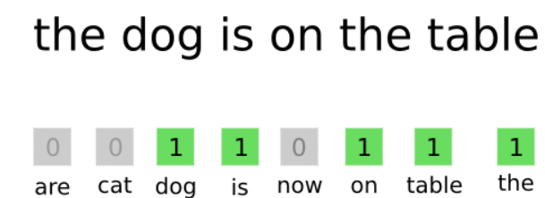
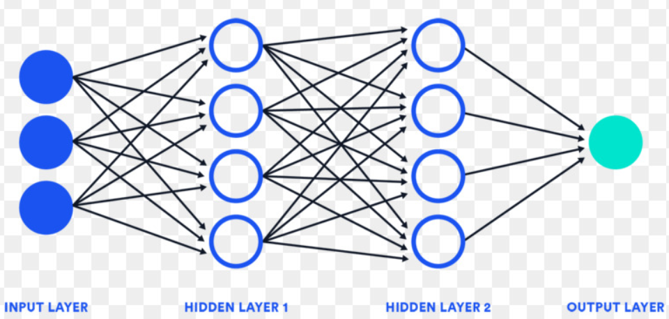

# Indian Restaurant Chatbot- Project

+ [Table of Contents](#sub-sub-heading-1)
    + [Credits](#credits)
    + [Project Goal and procedure](#project-goal-and-procedure)
    + [Code and Resources](#code-and-resources)
    + [Part 1- Creating a JSON-file](#part-1--creating-a-json-file)
    + [Part 2- Data Preprocessing](#part-2--Data-preprocessing)
    + [Part 3- Model Building](#part-3--model-building)
    + [Part 4- ChatBot Dialogue Demonstration](#part-4--chatbot-dialogue-demonstration)

### Credits: 
A big thank you goes to [KenJee](https://www.youtube.com/channel/UCiT9RITQ9PW6BhXK0y2jaeg), [Codebasics](https://www.youtube.com/channel/UCh9nVJoWXmFb7sLApWGcLPQ), [Krish Naik](https://www.youtube.com/user/krishnaik06), [Keith Galli](https://www.youtube.com/channel/UCq6XkhO5SZ66N04IcPbqNcw)  and to the whole [Edureka Team](https://www.youtube.com/user/edurekaIN) who put a lot of effort to teach people Data Science, Machine Learning, Statistics and a lot of other related topics for free.

### Project Goal and procedure: 
* Goal:Build a simple ChatBot for a fictive Indian Restaurant which is able to answer customers questions
* Creating a json file with possible input messages from the user and the appropriate responses from the Bot.

### Code and Resources
* Python Version: 3.6
* Environment: Pycharm
* Packages: Numpy, NLTK, Tensorflow, Tflearn

## Part 1- Creating a JSON-file
In the first step it is necessary to create a JSON file with a defined structure:

1. Tag (unique name)
2. Patterns (The neural network will be trained on sentence patterns)
3. Responses (Once, our model recognizes what tag and pattern a user input belongs to, it will give us back the respective response).
That JSON- file is the training data for our model. The more input the JSON file gets, the better and more complet the final ChatBot will be.

A Snippet of the context based JSON file (the whole file can be found on Github- see below):

## Part 2- Data Preprocessing

After creating the customized JSON-file its time to proprocess the data. In our case, we have to do ,,Word Stemming" and create a ,,Bag of Words".
In the Natural Language Processing (NLP), ,,Word Stemming" is the process to reduce a word to its root/base. For example, the root of the word ,,cars" is ,,car" and the root of ,,selecting" is ,,select". 
Since Machine Learning Algorithms do not understand textual data and require numerical input, we use the ,,Bag of Words" approach to meet this requirements so that texts can be converted to numeric vectors. This ,,Bag of Words" will be the input for the input layer in the next step. 
If a word is present in a given text, we get back a "1", otherwise we get back a "0". 
The following simplified image illustrates the idea behind the ,,Bag of Words":

## Part 3- Model Building

After the preprocessing part is completed, we have to build and train our model. Here, we will use a neural network with two hidden layers. The goal of the network is to look on the bag of words and find out to what tag it belongs to (remember that we defined the tags in our json file). 

The whole idea behind neural networks (base of deep learning) is to take a dataset (input), train themselves to recognize specific patterns in that data and to predict an output for a new (not familiar) data. Neural networks are made of several layers. 

The input layer takes the input data, the output layer predicts the output and the hidden layers perform most of the computational tasks. A network has always one input layer, one outpur layer and n-hidden layers. There is no rule how many hidden layers are required, often it can be found out by ,,Try and Error". 

As already mentioned, after the user types something in, the input will be converted to a bag of words. Afterwards the model predicts what class the input most probably belongs to. Finally, a response from that class (see JSON-file) and will be picked and given back to the user as an answer.

## Part 4- ChatBot Dialogue Demonstration
Let's build a fictive scenario. Image there is a customer who is new in Frankfurt, Germany and wants to eat at an Indian Restaurant. Since that person does not know which restaurant is the best one, he decides to do a Google search. Finally that person is directed to a Homepage of an Indian resturant which opened a few weeks ago. That website has a chatbot which pops up when the site opens.
Our person will do the following steps now:

- Greeting the bot
- Ask when the restaurant is open
- Ask for food recommendation
- Make sure card payments are accepted
- Ask for location
- Ask for home delivery
- Say thank you and good bye

You can click on the following picture and you will be redirected to GoogleDrive where you can take a look on the the ChatBot Interaction (make sure you watch the video with the highest resolution):

